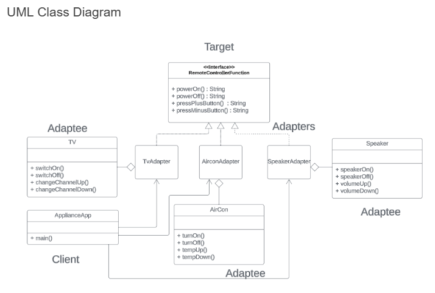

# ⚡ Plugging Devices into Power Outlets (Adapter Pattern)

## 📄 Problem Statement
You are developing an application that helps users manage and control various electronic devices by plugging them into power outlets. Each device has different plug types, voltage, and amperage requirements. To ensure compatibility and safety, you need to create adapters for different devices to allow them to be plugged into standard power outlets.

### Adaptee Objects:
- **Laptop** – Represents a laptop device that needs to be plugged into a power source. It has the `charge()` method.  
- **Refrigerator** – Represents a refrigerator device that requires a power source. It has the `startCooling()` method.  
- **SmartphoneCharger** – Represents a smartphone charger that needs to be plugged in for charging. It has the `chargePhone()` method.  

### Target Object:
- **PowerOutlet** – Represents a standard power outlet with a common interface for plugging in devices. It defines the `plugIn()` method as the target method.  

### Adapter Objects:
- **LaptopAdapter** – Adapts a Laptop to the PowerOutlet interface by translating `plugIn()` to `charge()`.  
- **RefrigeratorAdapter** – Adapts a Refrigerator to the PowerOutlet interface by translating `plugIn()` to `startCooling()`.  
- **SmartphoneAdapter** – Adapts a SmartphoneCharger to the PowerOutlet interface by translating `plugIn()` to `chargePhone()`.  

---

## 🧩 UML Class Diagram

---

## 💻 Java Source Files
- `interfaces/PowerOutlet.java`
- `devices/Laptop.java`
- `devices/Refrigerator.java`
- `devices/SmartphoneCharger.java`
- `adapters/LaptopAdapter.java`
- `adapters/RefrigeratorAdapter.java`
- `adapters/SmartphoneAdapter.java`
- `Main.java`

---

## ▶️ How to Run
```bash
javac devices/*.java adapters/*.java interfaces/*.java Main.java
java Main
